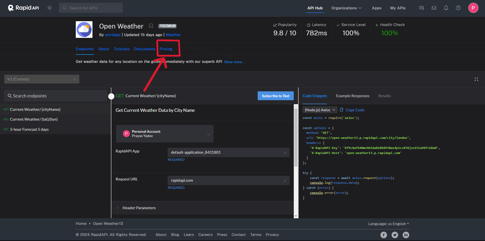
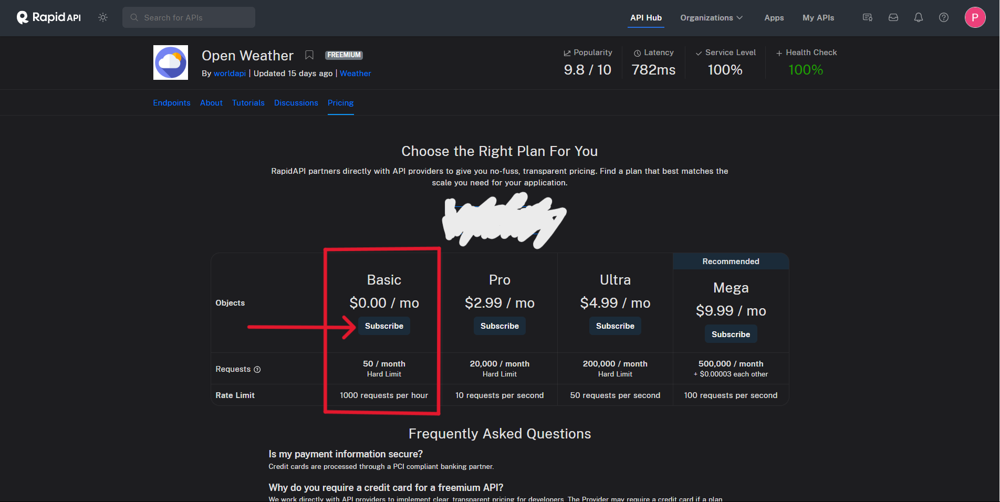
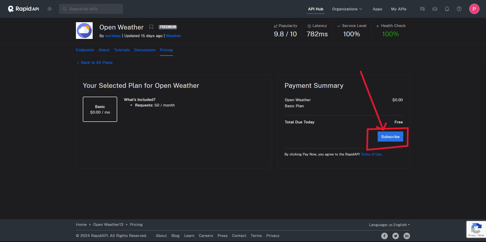

# Project Tour

## tri-api

Multi-API Data Display is an open-source web application that fetches information from three different APIs and displays the data on separate pages. Each API provides unique data sets, allowing users to explore diverse content within the same application.

## Features

- Feature 1: An IMDB API, where one can fetch all data about entertainment.
- Feature 2: A Cars API, where one can fetch all data about cars and its functioning.
- Feature 3: A Currency API, where one can convert one currency to another.

## Folder Structure
- 1: The component folder would contain all the different user made components.
- 2: All folders other than the Home and Navbar would contain a file, where one would use the 'axios.create()' method on the API and export it to the other folder, where it would be fetched.
- 3: The home page folder would contain the home page component.
- 4: The navbar folder would contain the navbar component.
- 5: Note that strongly recommend the contributor to make more files in these folders and use atomic component to 'increase code readability'.
- 6: Note that the contributor should use 'axios.create()' to fetch the API as it would be more suitable in fetching the given API.

## API links
- 1: IMDB API -- 'https://rapidapi.com/Glavier/api/imdb146'.
- 2: Cars API -- 'https://rapidapi.com/principalapis/api/car-data'.
- 3: Currency API -- 'https://rapidapi.com/solutionsbynotnull/api/currency-converter18'.

## How to use these API?
 Before using the API, follow these steps that were performed on a Dummy API.

 

 

 

 Only After performing the above three steps one can use these APIs.

## Contributing

We welcome contributions from the community! If you'd like to contribute to this project, please follow these steps:

1. Fork the repository.
2. Create a new branch for your feature or bug fix.
3. Make your changes and commit them.
4. Push to the branch.
5. Submit a pull request.

Please ensure that you clarify and discuss about the issue with me before sending me a pull request, so that the issue is solved in a correct manner. 

Please ensure that your code follows the project's coding standards and conventions, and include tests if applicable. Your pull request will be reviewed by the maintainers, and we'll get back to you as soon as possible.

